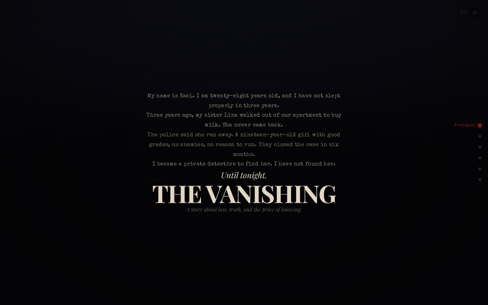

# EPOCH — The Vanishing

**A noir detective story about loss, truth, and the price of knowing. Told through cinematic scroll.**



---

## The Story

> *"My name is Kael. I have not slept properly in three years."*

Three years ago, Kael's sister Lina disappeared. The police closed the case. Kael became a detective to find her. Tonight, a new phone call leads him to the truth — one he was never prepared for.

**A story that will break your heart. 20–30 minutes of immersive noir storytelling.**

---

## Acts

| | Title | Duration | What Happens |
|---|-------|----------|-------------|
| **Prologue** | *The Vanishing* | 3 min | Kael introduces himself, his loss, his obsession |
| **Act I** | *The Call* | 4 min | A mother calls. Her daughter Mira is missing. Same age as Lina. |
| **Act II** | *The Scene* | 5 min | Mira's apartment. Her journal reveals she was investigating Lina's case. |
| **Act III** | *The Hunt* | 6 min | Three locations: jazz bar, office, pier. Each reveals more. |
| **Act IV** | *The Truth* | 5 min | The devastating revelation about Lina's fate. |
| **Act V** | *The End* | 5 min | Resolution. Lina's last letter. Kael finally cries. |

---

## Features

### Storytelling
- 📖 **20–30 min narrative** — Deep, emotional noir story with real characters
- 🌐 **Bilingual** — Full English & Indonesian (toggle button)
- ✍️ **Typewriter text** — Character-by-character reveal for key moments
- 📋 **Expandable clues** — Click to reveal investigation details
- 💔 **Emotional climax** — The truth about Lina will shock you

### Visual Design
- 🌧️ **Rain effect** — CSS-animated rain particles
- 🎞️ **Film grain** — Canvas noise overlay at 12fps
- 🖼️ **Vignette** — Radial gradient edge darkening
- 🪟 **Scene backgrounds** — Window with rain, desk lamp glow, harbor fog
- 🔴 **Noir palette** — Deep black, aged paper, red accents

### Audio
- 🔇 **Web Audio API** — Scene-based ambient soundscape
- 💓 **Heartbeat** — Low frequency pulse in tense moments
- 🎵 **Jazz tones** — Harmonic intervals for investigation
- 🎹 **Piano fade** — Melancholic ending

### Navigation
- 📊 **Scene timeline** — Clickable act navigator
- ⌨️ **Accessible** — Keyboard nav, reduced motion, screen reader
- 📱 **Responsive** — Mobile and desktop

---

## Tech Stack

| Category | Technology |
|----------|-----------|
| Framework | React 19 + TypeScript 5 |
| Build | Vite 6 |
| Styling | Tailwind CSS 4 |
| Audio | Web Audio API |
| Icons | Lucide React |
| Grain | Canvas 2D @ 12fps |
| i18n | Custom Context (EN/ID) |

---

## Design System

```
Palette:
  void     #040406    Deepest black
  deep     #080810    Background
  surface  #14141e    Cards
  ink      #e2d8c4    Primary text
  paper    #bfb49a    Secondary text
  red      #7a1818    Accent
  red-hot  #c42828    Highlights

Fonts:
  Special Elite        Typewriter (narration)
  Playfair Display     Serif (headlines, emotional moments)
  Inter                Body text
  JetBrains Mono       Labels
```

---

## Getting Started

```bash
git clone https://github.com/ferah1223/epoch.git
cd epoch
npm install
npm run dev
```

---

## Architecture

```
src/
├── context/Language.tsx    EN/ID translations (80+ keys)
├── components/
│   ├── Preloader           Case file loading
│   ├── Rain                CSS rain animation
│   ├── FilmGrain           Canvas noise overlay
│   ├── Vignette            Radial darkening
│   ├── Timeline            Act navigator
│   ├── AudioCtrl           Web Audio soundscape
│   └── LangToggle          EN/ID toggle
├── scenes/
│   ├── Prologue            Kael's introduction + window rain bg
│   ├── ActCall             Phone call, typewriter reveal
│   ├── ActScene            Crime scene, 3 expandable clues
│   ├── ActHunt             Horizontal scroll, 3 locations
│   ├── ActTruth            The devastating revelation
│   └── ActEnd              Lina's letter, resolution, credits
└── index.css               Tailwind + noir tokens
```

---

## License

MIT

---

*Powered by Xiaomi MiMo V2.5*
